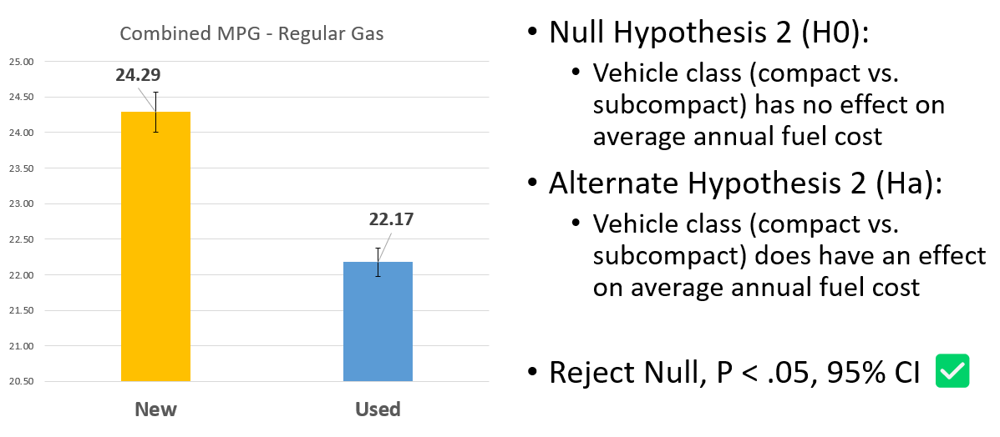

<!--- YAML HEADER
title: "Fuel Economy"
date: "11/02/2022"
image: "images/dynamic/dawn-mcdonald-lBP2muAsD94-unsplash.jpg"
format: html
editor: visual
--->

*Statistical Significance \| Fuel Economy*

<!---::: column-page-inset--->
## Project Summary 🗒️

### 🧭- Project scenario

-   Provide data-backed analysis and recommendations around vehicle fuel economy
-   Client is interested in vehicle types, manufacturers, and technical specs
-   They want to understand how those might drive fuel economy and annual fuel costs

| **Project Objective**                                                                      |
|------------------------------------------------------------------------|
| Identify and conduct statistical tests on factors that drive fuel economy and annual costs |

### 📂- Deliverables

*Click the icons or text below to see my project files and deliverables*

|                        [PowerPoint](https://1drv.ms/p/s!Ahpkb3AfX4xfhLwzWGT1K1IHn_Fk2A?e=RTB4IZ)                         |                           [Excel](https://1drv.ms/x/s!Ahpkb3AfX4xfhLxAdTGnqepw6EwTXA?e=QpBkSM)                           |
|:----------------------------------:|:----------------------------------:|
|  |  |

### 🔧- Methods

| Research Questions                                                                                    |
|------------------------------------------------------------------------|
| Does the Start / Stop Technology make a significant difference in fuel costs / consumption?           |
| Does the car's "age" or model year have a significant difference in fuel economy?                     |
| How significant is the car's class (car type: minivan, truck, compact...) in the consumption of fuel? |

-   Most vehicles use regular gas as a fuel type -\> focus on regular gas vehicles
    -   Regular gas is convenient, and already has nationwide infrastructure
-   Subcompact and compact vehicles are the most common classes -\> focus on these car classes
    -   These two classes are the most popular and they are quite similar in specific metrics
-   Car "age" determined by the model year -\> focus on new vs used

### 🔍- Findings

### **Start Stop Technology - Fuel Cost**

### **Car Class - Combined MPG**

### **Car Age - Used Fuel Quantity**

### **5 Year Savings and Spending**

### 💡- Recommendations

-   For fuel economy and savings, without sacrificing the convenience of regular gas, use cars with Start / Stop Technology
-   Prioritize using newer cars (2015 and newer) as on average they have a significantly better combined MPG than older counterparts
-   Implementing the above and using the compact vehicle class will offer the best savings in terms of fuel economy
<!---:::--->
