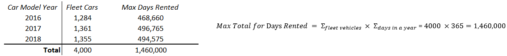

<!--- YAML HEADER
title: "Lariat Rentals"
date: "09/05/2022"
image: "images/dynamic/lariat-logo.jpg"
format: html
editor: visual
--->

*Rental fleet business analysis \| Revenue growth model*

## Project Summary 🗒️

### 🧭`- Project scenario`

-   I am consulting as a data analyst for Lariat

-   They hired me to make suggestions on how they can make smarter business decisions

-   My job is to analyze the costs and revenue generated by their rental car fleet

-   They provided me the data for their nationwide, 4,000-car fleet

 

| Lariat's Business Objective             |
|-----------------------------------------|
| Minimizing costs and maximizing revenue |

 

### 📂`- Deliverables`

*Click the icons or text below to see my project files and deliverables*

|                        [PowerPoint](https://1drv.ms/p/s!Ahpkb3AfX4xfhLwtwCAS3g6L6ZA6sQ?e=3JhUY6)                         |                           [Excel](https://1drv.ms/x/s!Ahpkb3AfX4xfhLw5nv0BCOoHdWSS5g?e=knZCre)                           |
|:----------------------------------:|:----------------------------------:|
|  |  |

 

### 🔧`- Methods`

-   Data cleaning and exploration

-   Defining parameters

    

-   Group vehicles by model year for baseline

    -   Break down "the numbers" to the daily level (ex. Revenue per day, cost per day...)

    

-   Create a user scenario that can take custom values and apply them to the baseline

### 🔍`- Findings`

-   The top 4 most popular car makes: Ford, Chevrolet, Dodge, and Toyota

    

    -   These 4 car makes account for over ¼ of the rental fleet

        

-   The daily revenue and cost per car does not vary much by model year

    

-   Total rental days is not significantly different among the 3 different car model years

 

### 💡`- Recommendations`

-   **Minimizing Costs**

    -   Retire and sell high-cost, low return vehicles

    -   Replace with more popular and higher revenue make/models

-   **Maximizing Revenue**

    -   Increase the prices for rentals

    -   When doing this assume a decrease in total days rented

