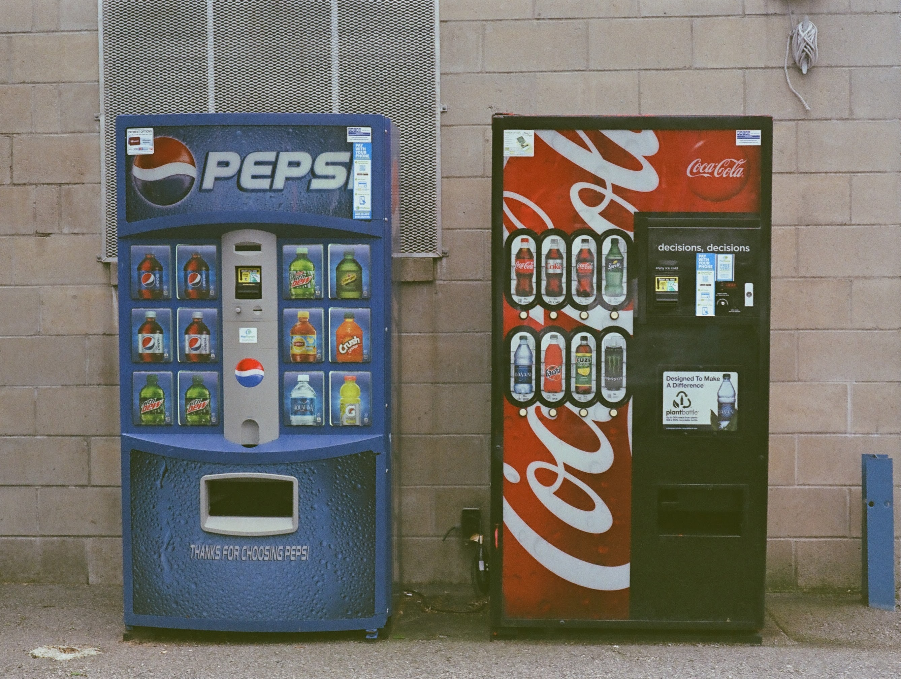
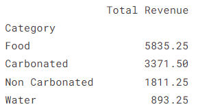
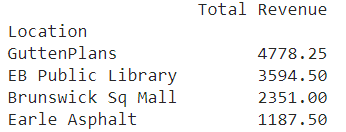
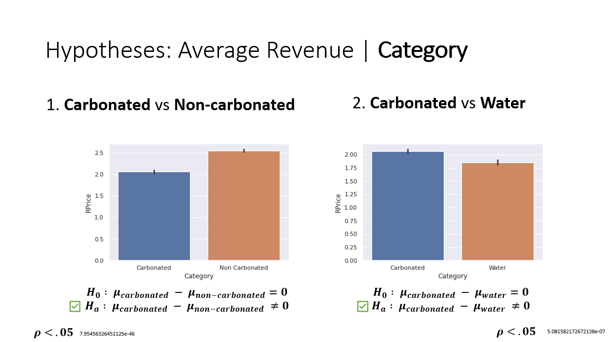
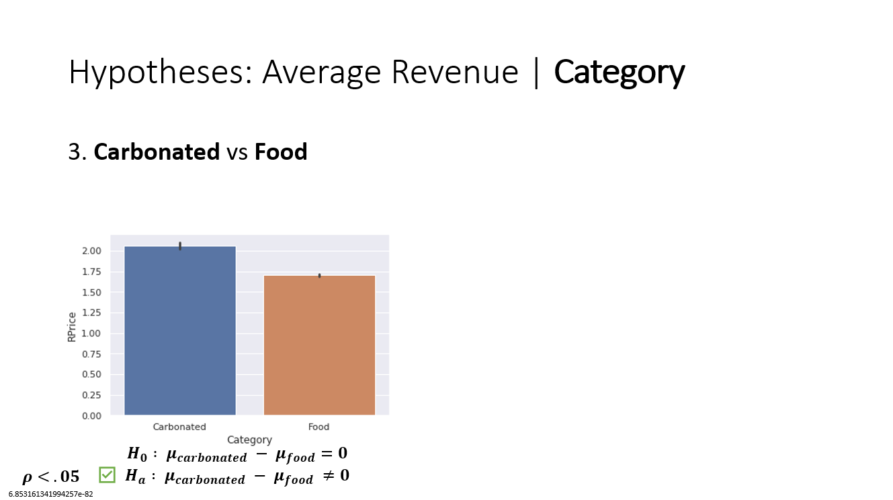
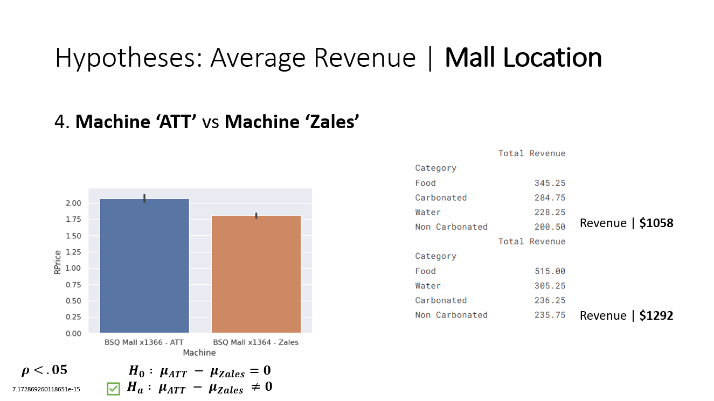
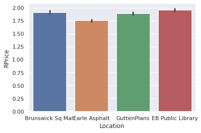

<!--- YAML HEADER
title: "Vending Machine Sales"
date: "12/10/2022"
image: "images/dynamic/nik-albert-pGQpBcylvOA-unsplash.jpg"
format: html
editor: visual
--->

*Python Data Analysis \| Vending Machine Sales*



<!---::: column-page-inset--->
## Project Summary 🗒️

### 🧭- Project scenario

-   Use Python and pandas to explore a dataset and ultimately craft an analysis for a final presentation

-   Create a notebook demonstrating a clear story about the research question, the hypothesis, and the results of testing it

-   Present findings and analysis process with a slide deck

<br>

| Dataset Used                                                                                             |
|----------------------------------------------------------------------------------------------------------|
| [Vending Machine Sales from Kaggle](https://www.kaggle.com/datasets/awesomeasingh/vending-machine-sales) |

<br>

### 📂- Deliverables

*Click the icons or text below to see my project files and deliverables*

| [Jupyter Notebook](https://www.kaggle.com/code/bradfordjohnson/vending-machine-sales-capstone-analysis)                                | [PowerPoint](https://1drv.ms/p/s!Ahpkb3AfX4xfhPE6uxwcIrXDVgXkZg?e=oQw3wp)                                       | [Project Proposal](https://1drv.ms/w/s!Ahpkb3AfX4xfhPBmVoPfmuF1tRpLpg?e=nUnan8)                                     |
|:-----------------------------------------------------------------------------------------------------------------------------:|:----------------------------------------------------------------------------------------------------------------------------------------:|:----------------------------------------------------------------------------------------------------------------------------------------:|
| [](https://www.kaggle.com/code/bradfordjohnson/vending-machine-sales-capstone-analysis) | [](https://1drv.ms/p/s!Ahpkb3AfX4xfhPE6uxwcIrXDVgXkZg?e=oQw3wp) | [](https://1drv.ms/w/s!Ahpkb3AfX4xfhPBmVoPfmuF1tRpLpg?e=nUnan8) |

<br>

### 🔧- Methods

-   Data cleaning and exploration using Python

-   Pandas, NumPy, seaborn, etc.

    | **Research Questions**                                                  |
    |-------------------------------------------------------------------------|
    | ```What product categories generate the most revenue on average?``` |
    | ```How can the product selection be optimized to increase revenue? ```|
    | ```What vending machine locations generate the most sales?``` |
    | ```How can vending machines be optimized by location?``` |

<br>

### 🔍- Findings


|  |  |
|-----------------------------------------------|---------------------------------------------|

<br>



<br>



<br>



<br>



<br>

### 💡- Recommendations

#### Overall

> **Space is limited** \| Optimize the space used and customize the selection based on location
>
> -   Condense product selection to meet consumer preferences to **increase revenue**
>
> -   Balance selection and variety to **lower costs** for buying in bulk *(economy of scale)*
>
> -   Locations where people work or spend lots of time tend to have more purchases

#### Location Specific

> **Brunswick Sq Mall**
>
> -   Keep only the '*ATT*' vending machine
>
> -   Allocate the majority of space for food and water options, with the carbonated and non-carbonated options only being for the most popular overall products
>
> **Earle Asphalt**
>
> -   Majority of options should be food products
>
> -   Water, carbonated and non-carbonated options only being the most popular for this location
>
> **Gutten Plans**
>
> -   Majority of options should be food and carbonated drink products
>
> -   Non-carbonated options should only be the most popular for this location
>
> -   Test with the most popular water products to see if this option is in demand
>
> **EB Public Library**
>
> -   Majority of vending products should be food
>
> -   Stock popular carbonated drinks and non-carbonated product options
>
> -   Only the most popular water products should be stocked at this location
<!---:::--->
